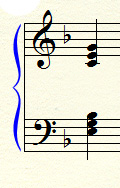

# guitar-model
STUDENT EXERCISE: An exercise on abstract classes in which different stringed instruments, preferably fretted, are derived from an abstract super class. The fact that this model focuses on is that stringed instruments have strings, which places certain limitations on what can be played, limitations that are not always reflected in music software.

For example, look at the following chord:

